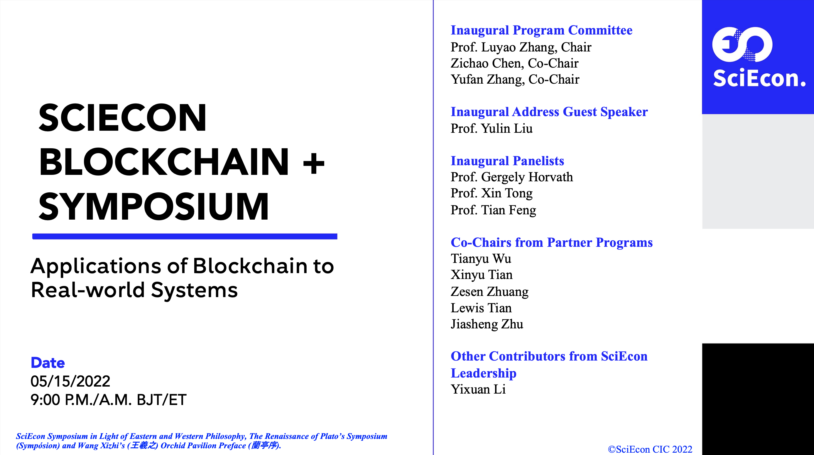

# Applications of Blockchain to Real-world Systems

<!-- ### SciEcon Blockchain + Mechanism Design Program -->

> **SciEcon Blockchain + Mechanism Design Program**

> SciEcon Lab Incubator Program

> 2022 Spring

---

## **Overview**

### Symposium Background

This seminar is hosted by the SciEcon Blockchain+ Mechanism Design Program, supervised by Professor Luyao Zhang, and proposed by lab leaders: Josh Manto and Yutong Sun. As the newest lab in SciEcon, the Blockchain+ lab aims to showcase the significance of blockchain applications by presenting six of our blockchain-themed research papers. We look forward to having prolific discussions and collaborations with the audience. 

### Background of the Core Research Topic of the Lab

The core research topic centers on the applications of Blockchain in different areas. The first paper, Josh Manto, is centered on the applications of blockchain to decentralize the cloud computing field. The second paper, by Yutong Sun, focuses on the application of blockchain to supply chains and finance risk identification. The third paper by Tingyu Cai is about how blockchain can solve problems found in supply chains. The fourth paper by Yuming Gong features a proposal for a blockchain-based social media platform. The fifth paper by Yuxi Jiang features an analysis on how blockchain can solve financial fraud, and the last paper by Yu Cheng aims to understand how blockchain can revolutionize the financial industry. 

### Lab Project Overview

The project aims to understand and showcase the applications of blockchain to the field of cloud technology, the financial industry and anti-fraud tactics, social media, and the supply chain. 

### Symposium Sketch

The symposium comprises online presentations for three articles. Each presentation lasts 10 minutes, with 30 minutes of panel discussion allotted after the presentation.

---

## **Symposium Agenda**

### A Blockchain-based Decentralized Cloud Storage with“Keeper-and-Distributor” Systems

**Author**: Josh Manto

**Title**: Decentralizing the Cloud by Implementing Blockchain and “Keeper-and-Distributor” Systems

**Medium Article Publication**: NOT YET PUBLISHED

**Abstract**: The majority of cloud computing services today are managed and owned by major tech companies. Two major cybersecurity risks arise with cloud computing centralization: first, user data privacy issues, such as the unlawful selling of user data to third parties, and second, overall data security such as data breaches and hacks. In this paper, I propose a decentralized cloud storage model built on the blockchain that has a “keeper-and-distributor” system. This model is more secure due to its “keeper-and-distributor” feature and is able to respect user data privacy because the data audit trail is stored and accessible in the blockchain. 

---

### Supply Chain Finance Risk Identification and the Corrective Role of Blockchain

**Author**: Yutong Sun

**Title**: Supply Chain Finance Risk Identification and the Corrective Role of Blockchain

**Medium Article Publication**: NOT YET PUBLISHED 

**Abstract**: The supply chain is an essential and important link in the production and distribution process, which revolves around the core companies, links upstream and downstream suppliers and distributors, and involves regulators and financial institutions, connecting them in a chain. Because supply chain financial service involves several enterprises and financial institutions, its risk is transmitted upstream and downstream with the trade between enterprises in the supply chain, making the risk cover the whole supply chain from a single enterprise. And blockchain, because of its transparent, irreversible, and open information characteristics, can be used to design supply chain information-sharing mechanisms, consensus mechanisms, and incentive mechanisms to help solve the potential risk problem of the supply chain. This paper summarizes and concludes the potential risks of the supply chain system after an extensive literature review, and analyzes how to use the functions and advantages of blockchain to correct these risks one by one. And at the end, a blockchain application scenario of a commercial bank in China is provided as a case study.

---

### Blockchain Applications on the Supply Chain

**Author**: Tingyu Cai

**Title**: Popularly-claimed Advantages and Followed-up Suspicions Regarding the Real Applicability and Effectiveness

**Medium Article Publication**: NOT YET PUBLISHED 

**Abstract**: The supply chain is a vital network for business production and delivery from suppliers to consumers. Due to the centralized architecture of its management system and the complicated process of transactions involving numerous intermediaries, the global supply chain has long been troubled by inefficiency and misconduct. Blockchain technology, on the other hand, has been popularly viewed as a promising tool to solve the supply chain problem due to its unique mechanism that brings transparency, security, and efficiency to the network. However, this article significantly argues that it might be too early to draw the conclusion that blockchain will guarantee a good performance after implementing it in the supply chain. In fact, it is even too early to conclude that blockchain can be successfully adopted by a fair number of firms and with proper scale. The paper first summarizes two key types of supply chain problems and the application potential of blockchain technology to solve them, and then proposes four fundamental questions as suspicions on real applicability and effectiveness. In the end, a list of potential future research directions will be presented.  

---

### Possible Improvements Made by Blockchain Technology to Social Media

**Author**: Yuming Gong

**Title**: Possible Improvements Made by Blockchain Technology to Social Media

**Medium Article Publication**: NOT YET PUBLISHED

**Abstract**: At present, with the rapid development of Internet information technology, social media and their large amount of information are showing explosive growth. At the same time, traditional social media has been utilized as a tool to spread fake news and misinformation, which brings with it other issues such as privacy security and information authenticity. There should be some solutions to ensure data security and to fact-check the information disseminated in the platform. It is foreseeable that the application of blockchain technology may trigger a new round of reform in the social media industry. This paper aims to summarize some drawbacks of traditional social media and explore how blockchain technology can be used as a tool to curb the spread of fake news and personal privacy as well as regulating and holding people accountable for these social problems. At the end of the paper, a case study is used explore the feasibility of applying blockchain technology to current social media industry

---

### Analysis of the possibilities and difficulties of using blockchain technology: Is blockchain technology effective enough to prevent the occurrence of financial fraud?

**Author**: Yuxi Jiang

**Title**: Analysis of the possibilities and difficulties of using blockchain technology: Is blockchain technology effective enough to prevent the occurrence of financial fraud?

**Medium Article Publication**: NOT YET PUBLISHED

**Abstract**: In recent years, financial fraud has been a shared network problem that endangers individuals, enterprises, and institutions' psychology, reputation, and property safety. As an emerging technology, blockchain has the advantages of information stability and data confidentiality brought by decentralization. I will explore the possibilities and difficulties of blockchain applications in financial anti-fraud by combining the case of Everledger and JD.COM in diamond supply chain tracking and the related literature review.

---

### The Imperative development and Challenges of Blockchain Technology in Finance 

**Author**: Yu Cheng

**Title**: The Imperative development and Challenges of Blockchain Technology in Finance 

**Medium Article Publication**: NOT YET PUBLISHED

**Abstract**: The concept "blockchain" originated from the decentralized public ledger technology of Bitcoin. Even in its infancy, blockchain technology has demonstrated its power to revolutionize various industries. Decentralization, transparency, and immutability are appealing to businesses across the world, but finance is leading the way in terms of the implementation of blockchain technology. In the process of exploring the application of blockchain, challenges and problems will inevitably arise at the same time. 

---

## **Bios**

### Josh Manto [[LinkedIn](https://www.linkedin.com/in/josh-manto/)]

{: style="height:300px"}

**DKU sophomore student majoring in Data Science | SciEcon Blockchain+ Lab Leader**

Josh Manto is a sophomore student at DKU majoring in Data Science. He is the lab leader for SciEcon Research Lab. He has a solid foundation in Data Science, a wealth of experience in research, and has since managed two e-commerce startups to this day. His area of interest is in developing web3 and blockchain-based applications. 

### Yutong Sun [[LinkedIn](https://www.linkedin.com/in/yutong-sun-/)]

{: style="height:300px"}

**DKU junior student majoring in Applied Mathematics | SciEcon Blockchain+ Lab Leader**

I am Sun Yutong, a junior student at Duke Kunshan University majoring in Applied Mathematics and Computational Science. I am so glad and excited to be a part of the SciEcon Lab! My research interest is in financial technology and financial mathematics. Previously, I have done some research on commercial leverage ratios using machine learning models, and Blockchain, as one of the hottest research topics in FinTech, is also one of my research directions. I am interested in doing research on this topic from a mathematical point of view, such as applying the mean-field game model to analyze the centralization phenomenon of mining on blockchain.

### Tingyu Cai [[LinkedIn](https://www.linkedin.com/in/tingyu-cai-479a5b201/)]

{: style="height:300px"}

**DKU Sophomore Student majoring in Political Economy | SciEcon Blockchain+ Lab Member**

Tingyu Cai is a sophomore majoring in Economics at Duke Kunshan University (dual degree with Duke University). He has a solid foundation in macroeconomic theories, and he is good at using Excel for data visualization and analysis. He is responsible, focused, and always passionate about learning new things. His research interests lie in areas including macroeconomic analysis, global trade, international affairs, industrial research, business strategic management, and marketing. He is currently working as a research team member under Professor Luyao Zhang’s Blockchain+ Research Program.

### Yuming Gong (Lisa) [[LinkedIn](https://www.linkedin.com/in/%E8%B4%A1%E9%92%B0%E8%8C%97Lisa/)]

{: style="height:300px"}

**DKU Sophomore majoring in Political Economy | SciEcon Blockchain+ Lab Member**

Yuming Gong is a sophomore student at Duke Kunshan University (DKU). She majors in Political Economy with the track of Economics. She works as DKU ECE marketing Assistant and also serves as the head of DKU Football Association Publicity Department. As she often deals with all kinds of social media, she is concerned about the threat to public information security brought by the new blockchain social media. She wants to further explore the changes blockchain brings to social media and work on addressing some of this industry's pain points.

### Yuxi Jiang (Trudy) [[LinkedIn](https://www.linkedin.com/in/trudyjiang/)]

{: style="height:300px"}

**DKU Sophmore majoring in Political Economy | SciEcon Blockchain+ Lab Member**

Yuxi is now a sophomore student majoring in Political Economy with the ECON track at Duke Kunshan University (DKU). She is passionate about interdisciplinary studies of economics, especially those related to Finance, Governance, Global Health, and Behavioral Science. She is now a newcomer in research and wants to do research in the above areas of interest.

### Yu Cheng (Gloria) [[LinkedIn](https://www.linkedin.com/in/gloria-cheng-53515a236/)]

{: style="height:300px"}

**DKU Sophomore majoring in Data Science | SciEcon Blockchain+ Lab Member**

I am a UG 2024 student majoring in Data Science. I have basic proficiency in Python, Matlab, and Java. I have experience in leadership and research and am the research assistant for the DKU-Fudan Econ Hist project. I take a profound interest in Data + Econ and the specific direction is still being explored.

---

### Inaugural Program Committee

Prof. Luyao Zhang, Chair

Zichao Chen, Co-Chair

Yufan Zhang, Co-Chair

### Inaugural Address Guest Speaker

Prof. Yulin Liu

### Inaugural Panelists

Prof. Gergely Horvath

Prof. Xin Tong

Prof. Tian Feng

### Co-Chairs from Partner Programs

Tianyu Wu

Xinyu Tian

Zesen Zhuang

Lewis Tian

Jiasheng Zhu

### Other Contributors from SciEcon Leadership

Yixuan Li
